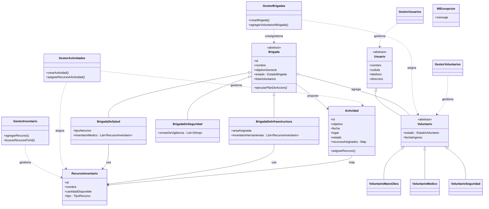

# Documentación Técnica: Sistema de Gestión de Voluntarios (UML)

## 1. Módulos de Control (Capa Lógica - Gestores)

Estas clases orquestan la lógica de negocio.

### `GestorInventario`

* **Responsabilidad:** CRUD de recursos del inventario.
* **Métodos:** `agregarRecurso`, `buscarRecursoPorId`, `eliminarRecurso`, `obtenerTodoElInventario`.

### `GestorActividades`

* **Responsabilidad:** Gestión del ciclo de vida de las actividades y asignación de recursos.
* **Métodos:** `crearActividad`, `asignarRecursoAActividad`, `listarActividadesPorEstado`.

### `GestorBrigadas`

* **Responsabilidad:** Creación polimórfica de brigadas y asignación de voluntarios.
* **Métodos:** `crearBrigada` (Factory), `agregarVoluntarioABrigada`, `removerVoluntarioDeBrigada`.

### `GestorUsuarios` y `GestorVoluntarios`

* **Responsabilidad:** Administración de usuarios y voluntarios específicos.

---

## 2. Entidades Principales (Modelo de Dominio)

### 👤 Usuario (Clase Abstracta)

* **Atributos:** `id`, `nombre`, `cedula`, `telefono`, `direccion`.

### 🙋 Voluntario (Clase Abstracta)

* **Herencia:** Extiende de `Usuario`.
* **Atributos:** `estado`, `fechaIngreso`.

#### Subclases de Voluntario:

* `VoluntarioMedico`, `VoluntarioManoObra`, `VoluntarioSeguridad`, etc.

---

## 3. Operativa: Brigadas y Actividades

### 🛡️ Brigada (Clase Abstracta)

* **Atributos:** `id`, `nombre`, `objetivoGeneral`, `estado`, `listaVoluntarios`.
* **Métodos:** `ejecutarPlanDeAccion()` (Abstracto).

### 🏥 BrigadaDeSalud

* **Atributos:** `tipoAtencion`, `inventarioMedico` (`List<RecursoInventario>`).

### 🏗️ BrigadaDeInfraestructura

* **Atributos:** `areaAsignada`, `inventarioHerramientas` (`List<RecursoInventario>`).

### 🚨 BrigadaDeSeguridad

* **Atributos:** `zonasDeVigilancia` (`List<String>`).

### 📅 Actividad

* **Atributos:** `id`, `objetivo`, `fecha`, `lugar`, `estado`, `resultados`.
* **Optimización:** Maneja los recursos asignados internamente mediante un Mapa (`Map<RecursoInventario, Integer>`).

---

## 4. Gestión de Inventario

### 📦 RecursoInventario

* **Atributos:** `id`, `nombre`, `cantidadDisponible`, `tipo` (`Enum TipoRecurso`).

---

## 5. Utilidades y Excepciones

### `MiExcepcion`

* Excepción personalizada para errores de lógica de negocio.

---

## 6. Diagrama en Código (Mermaid Syntax)

